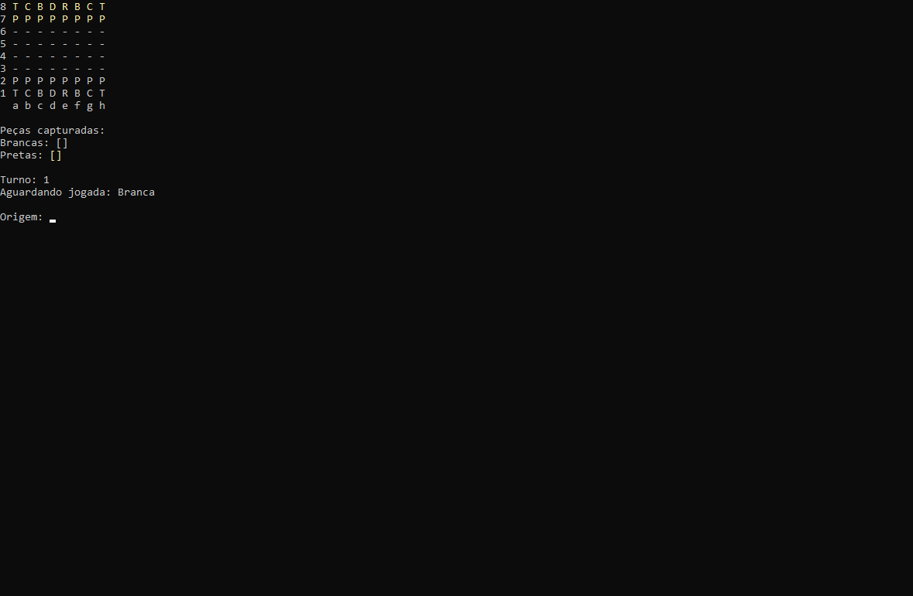

<h1>♟️ Sistema de Xadrez em C#</h1>

Este projeto foi desenvolvido como parte do curso C# - Programação Orientada a Objetos**, com o objetivo de praticar os principais conceitos da linguagem e da programação orientada a objetos (POO).

<h2>📚 Conceitos abordados</h2>

<ul>
  <li>
Encapsulamento
</li>
  <li>
Herança
</li>
  <li>
Polimorfismo
</li>
  <li>
Classes e métodos abstratos 
</li>
  <li>
Enumerações (Enum)
</li>
  <li>
Tratamento de exceções (try-catch)
</li>
  <li>
Estruturas de dados (matrizes, listas)
</li>
</ul>

<h2>🛠️ Tecnologias utilizadas</h2>

<ul>
  <li>
Linguagem: C#
</li>
  <li>
IDE: Visual Studio
</li>
</ul>

<h2>🎯 Objetivo do projeto</h2>

Criar um sistema de xadrez funcional no terminal, com regras básicas implementadas, controle de turnos, validação de movimentos e estrutura de peças baseada em orientação a objetos.

<h2>▶️ Como executar</h2>

1. Clone o repositório: git clone https://github.com/seu-usuario/sistema-xadrez-csharp.git

<h2>📷 Imagem do projeto</h2>

